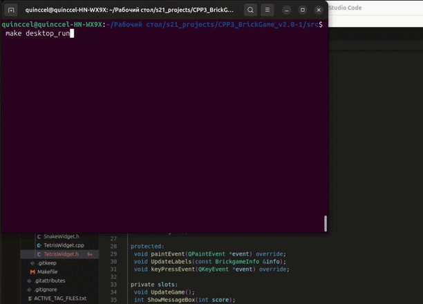

## BrickGame v2.0

The project consists of two separate components to implement the Snake game: a library responsible for implementing the game logic and a desktop GUI.

The developed library must also be connected to the console interface of BrickGame v1.0. The console interface must fully support the new game.

The Tetris game developed in BrickGame v1.0 must be connected to the desktop interface developed in this project. It must fully support the game.

## Game control

* Classic Tetris gameplay with the following mechanics:
    - Rotation of tetrominoes
    - Horizontal movement of tetrominoes
    - Accelerated tetromino falling (by holding the down arrow key)
    - Display of the next tetromino
    - Line clearing
    - Game over when the tetromino reaches the top of the game field

* Classic Snake gameplay with the following mechanics:
    - The snake must move on its own, one block ahead, when the game timer runs out.
    - When the snake hits an "apple", its length increases by one.
    - When the length of the snake reaches 200 units, the game ends and the player wins.
    - If a snake hits a field boundary or itself, the game ends with the player losing.
    - The user can change the direction of the snake's movement using the arrows, and the snake can only turn left and right relative to the current direction of movement.
    - The user can speed up the snake's movement by pressing the action key.

* Support for all physical buttons on the console:
    - Start game - Enter
    - Pause - P
    - End game - Esc
    - Left arrow - move tetromino left
    - Right arrow - move tetromino right
    - Down arrow - accelerate tetromino falling
    - Up arrow - rotate tetromino

* The initial length of the snake is four "pixels".
* The playing field is 10 "pixels" wide and 20 "pixels" high.
* Prepare a diagram showing all states and transitions between them for the implemented FMS for project submission.

## Bonus mechanics

* Score Calculation Tetris
    - 1 line cleared: 100 points
    - 2 lines cleared: 300 points
    - 3 lines cleared: 700 points
    - 4 lines cleared: 1500 points

* Score Calculation Snake
    - 1 apple = 1 score

* High Score Tracking
    - Display of the player's current score and highest score achieved
    - Highest score is stored in a file or embedded database and persists between game sessions

* Level Progression Tetris
    - Progression of levels every 600 points
    - Increasing level increases the speed of tetromino falling

* Level Progression Snake
    - Progression of levels every 5 points
    - Increasing level increases the speed of snake moving

## Installation

1) do `git clone` repository.
2) navigame to `src/` directory.
3) run `make install` or just `make` to install project.
4) run `make run_cli` to start play in cli.
5) run `make run_desktop` to start play in desktop.

## Show Game

## Tetris CLI Gameplay

## Snake CLI Gameplay

## Tetris Desktop Gameplay

## Snake Desktop Gameplay

## Finite State Machine (FSM) Diagram Tetris

## Finite State Machine (FSM) Diagram Snake

